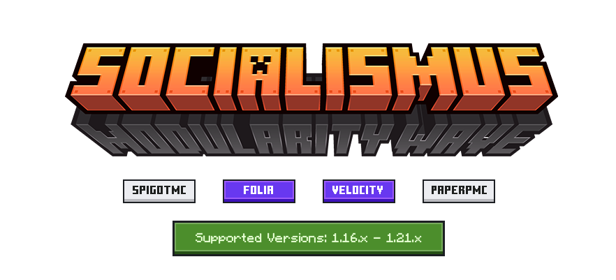

# Official modules

## Free modules

- [Chirper](https://github.com/whereareiam/Chirper) - The loudmouth of the server! Make sure your announcements are
  heard by all. Ideal for rallying the troops or just making sure everyone knows it’s pizza night.
- [Bubbler](https://github.com/whereareiam/Bubbler) *[WIP]* - The chat bubble artist! Elevate your conversations with
  animated
  bubbles that hover above players’ heads. Great for adding a splash of creativity to your chat.
- [BubblerLegacy](https://github.com/whereareiam/BubblerLegacy) *[WIP]* - Legacy version of Bubbler for older versions
  of
  Minecraft using Armor Stands instead of Text Displays.
- [Mentionator](https://github.com/whereareiam/Mentionator) *[WIP]* - The @mention maestro! Summon anyone and everyone
  with
  ease. Great for announcements, jokes, or just making sure you’re heard.
- [Swapper](https://github.com/whereareiam/Swapper) *[WIP]* - The message magician! Transform words into emojis,
  phrases,
  or anything you fancy. Perfect for adding a touch of surprise to your chat.
- [Warden](https://github.com/whereareiam/Warden) *[WIP]* - The chat cop! Keep your server safe and friendly with
  automatic moderation. Ideal for filtering out bad language, spam, or anything else you don’t want to see.
- [Essentials](https://github.com/whereareiam/Essentials) *[WIP]* - The essential toolkit! A collection of useful
  features
  that can extend your chat experience. Great for adding a touch of convenience to your server.
- [Statistics](https://github.com/whereareiam/Statistics) *[WIP]* - The data analyst! Keep track of your server’s
  activity with detailed statistics. Ideal for monitoring chat trends, player activity, and more.
- [Chatter](https://github.com/whereareiam/Chatter) *[WIP]* - Conditional chat helper! Your personal chat assistant
  that can help you with your chat needs. Great for adding a touch of automation to your server.

## Premium modules

- ChatterPlus *[WIP]* - Same as Chatter, but with AI capabilities.
- WardenPlus *[WIP]* - Same as Warden, allows you to connect to external services for better moderation.

# Statistics

  